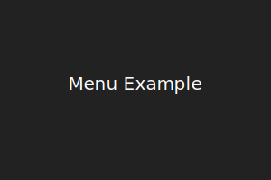
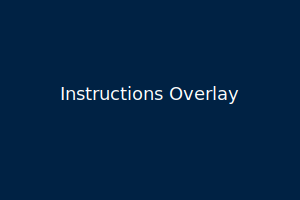
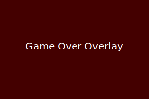

# Snake on Surfaces

## Overview

An AR/XR take on the arcade classic Snake. This project uses TypeScript and Three.js
with Vite for quick WebGL previews. See [docs/MECHANICS.md](docs/MECHANICS.md) for the
game rules and [docs/GAME_FLOW.md](docs/GAME_FLOW.md) for a flowchart of how the code
fits together.

### Recent Updates

 - Start menu allows selecting **Cube**, **Sphere**, or **Cylinder** surface, grid size and speed.
- On-screen instructions explain keyboard controls.
- Game over overlay shows final score with a prompt to restart.
- Images below show these features in action.

## Getting Started

Clone the repository and install dependencies with `npm install`.
Run `npm run dev` to start the development server and open `localhost:5173` in your browser.
Execute `npm test` to run the Vitest suite.
You can also try the Python CLI version with `python run_snake.py cube`, `python run_snake.py sphere` or `python run_snake.py cylinder`.
After each round it will prompt to play again.

## Building for Production

Run `npm run build` to produce a static build under `dist/`. To preview the
result locally, execute `npm run preview`. The project targets Node.js 20, so
ensure a compatible version is installed before running these commands.

## How to Play

Use the arrow keys or WASD to steer the snake. Press the spacebar to pause or resume.
Press **R** to reset the game after a game over.
Eat the red fruit to grow longer and earn points. The current score is shown in the
top-left corner when running the web version. Colliding with your own body ends the
game.

When the page first loads you'll see a **start menu** where you can choose the
surface shape, grid size and snake speed. After clicking Start, a short
instructions overlay appears and fades. When the snake collides with itself, a
Game Over message displays your final score and you can press **R** to try
again.





## Development


All code lives under `src/`. Unit tests reside in `tests/`.
Run the Python tests with:
```bash
python -m py_compile $(git ls-files '*.py')
python -m pytest -q
```

## Testing

Run the JavaScript suite with:

```bash
npm test
```

For the Python modules:

```bash
python -m py_compile $(git ls-files '*.py')
python -m pytest -q
```

Both sets of tests run in CI, including a small AI integration test, to ensure the project stays stable.

## Python CLI

For a simple text-based demo, run the Python version:

```bash
python run_snake.py            # play on a cube
python run_snake.py sphere     # play on a sphere
python run_snake.py cylinder   # play on a cylinder
```

Scores print to the console as you eat fruit.

### Simple AI Agent

An experimental `SimpleAgent` is provided under `python/ai/`. It chooses random
non-opposite directions so you can automate short runs. The AI is exercised in
`tests_py/test_ai_stability.py` and runs in CI to ensure future AI integrations
remain stable.

## License

This project is licensed under the MIT License.

## Assets and Attribution

The simple SVG images used in this repository (under `docs/images/`) were
created for demonstration purposes and are released under the CC0 license. You
are free to reuse or modify them.
