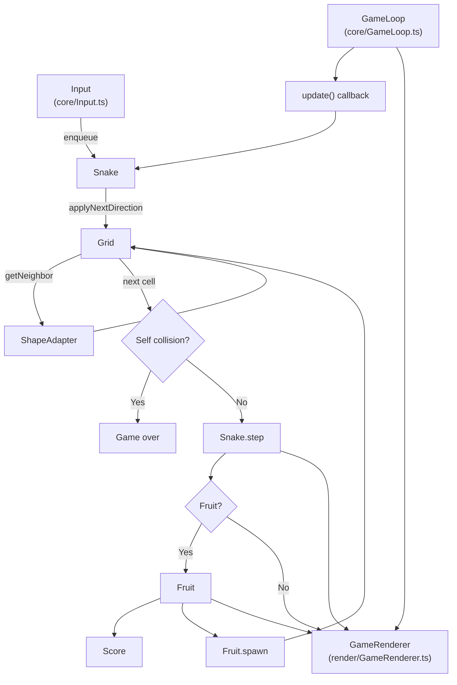

# Game Flow

This document provides an overview of how the main modules interact to run a game of **Snake on Surfaces**. Each box in the diagram represents a set of functions or classes responsible for a particular part of the system.

* **Input** – Captures keyboard events and queues direction changes on the `Snake`.
* **GameLoop** – Manages fixed-time updates and drives the main `update` callback.
* **Snake** – Handles direction, growth and collision detection.
* **Grid** – Provides neighbors and uses the active `ShapeAdapter` (cube or sphere) to wrap edges.
* **Fruit** – Spawns randomly on the grid, notifies listeners when eaten and updates `Score`.
* **GameRenderer** – Renders the snake and fruit each tick by converting grid cells to world coordinates with the `ShapeAdapter`.
* **Score** – Tracks the player score.
* **ShapeAdapter** – Implements cube or sphere mappings so grid coordinates can be placed in 3D space.

The game loop repeatedly invokes the update function which advances the snake, checks for fruit or collisions and emits a render event. Input, scoring and rendering all plug into this loop, keeping the game state synchronized.

